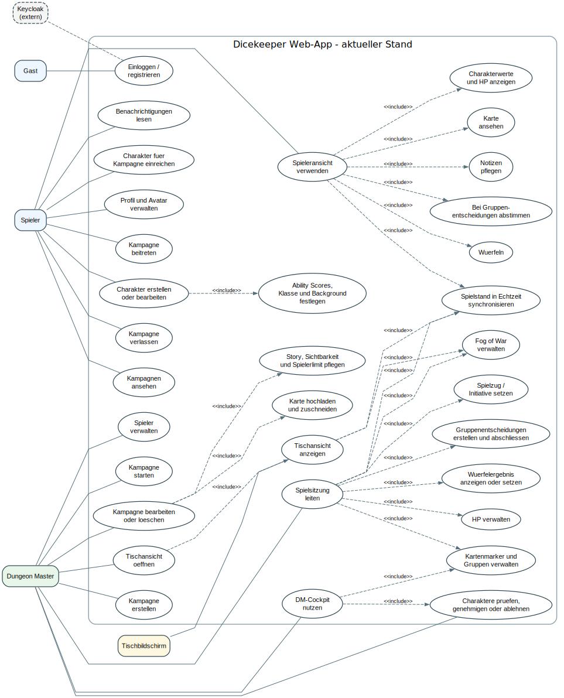
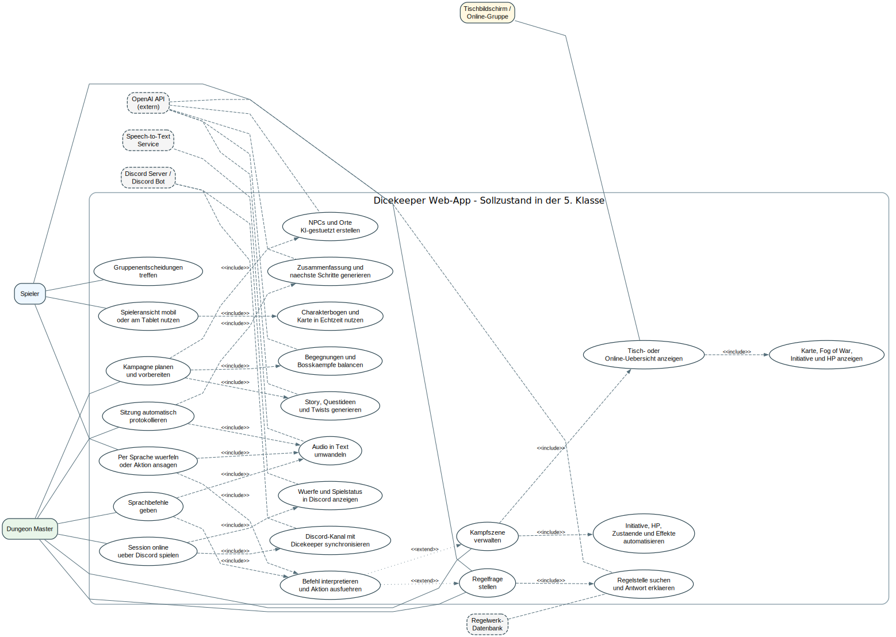
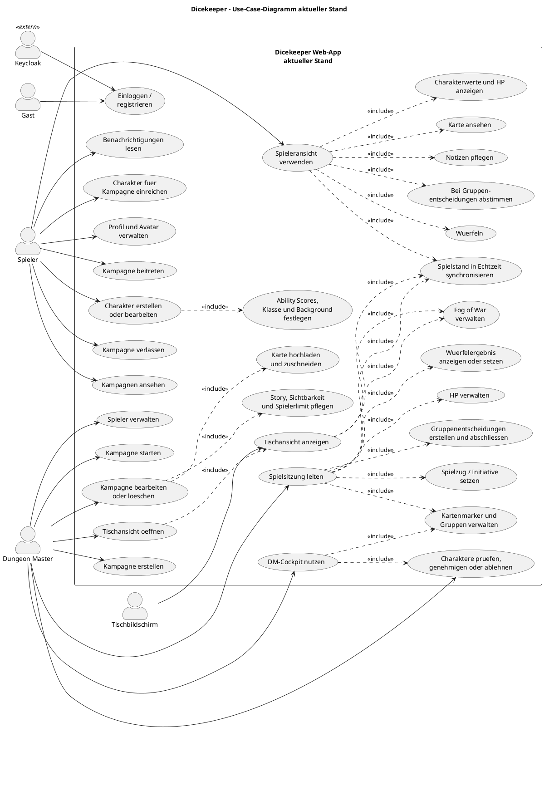
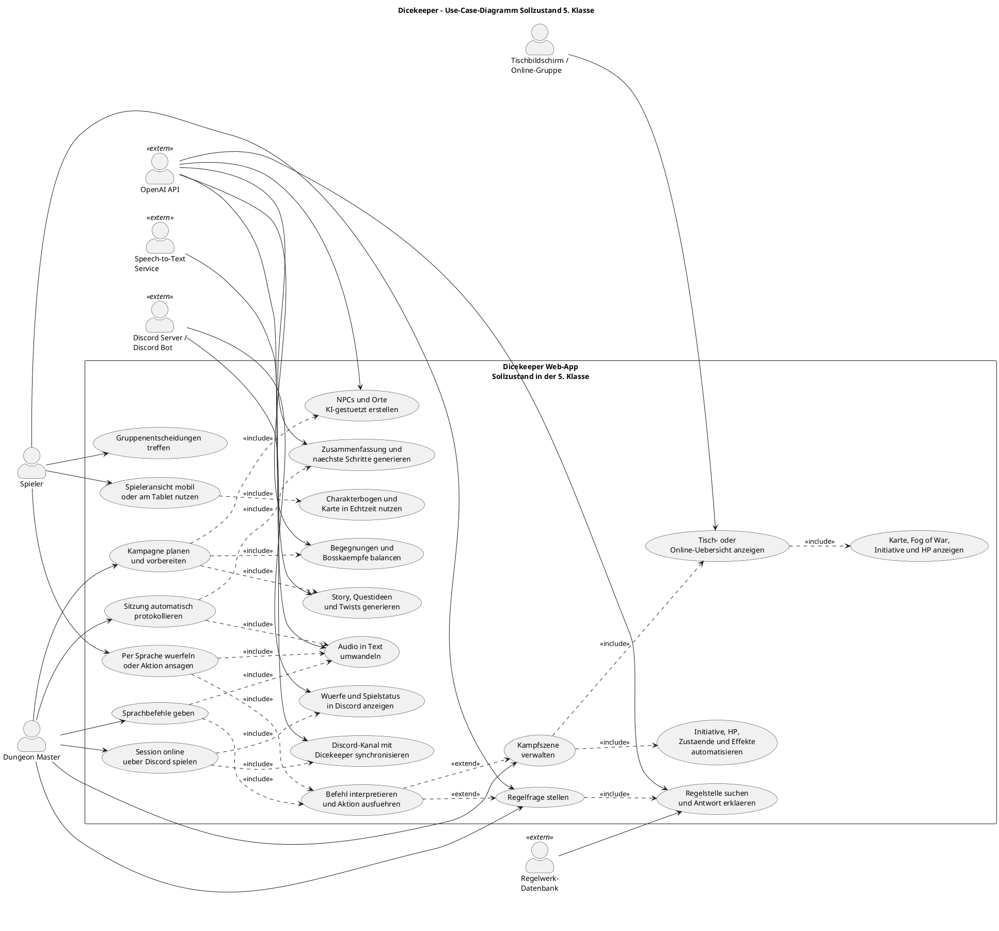

# Dicekeeper - Use-Case-Diagramme

Diese Datei enthaelt zwei Use-Case-Diagramme fuer Dicekeeper:

- [Aktueller Stand](usecase-aktueller-stand.puml): Funktionen, die im Projekt aktuell umgesetzt bzw. im Code sichtbar sind.
- [Sollzustand 5. Klasse](usecase-sollzustand-5-klasse.puml): geplante Weiterentwicklung mit KI-Einbindung, Spracherkennung, Discord-Integration und staerkerer Automatisierung.

Die gerenderten SVG-Versionen liegen hier:

- [Aktueller Stand als SVG](usecase-aktueller-stand.svg)
- [Sollzustand 5. Klasse als SVG](usecase-sollzustand-5-klasse.svg)

## Aktueller Stand

## Sollzustand 5. Klasse

